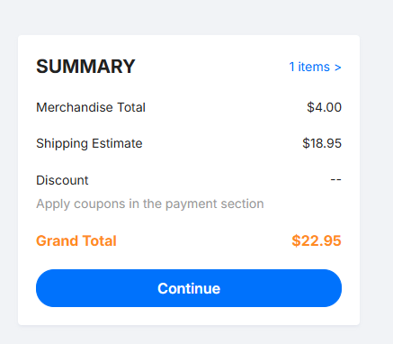

# Usbuh

This is a USB Hub that features USB-C input, an Auxilary Port with Audio in and out, three USB-A 2.0 ports, two USB-C 2.0 ports and a micro SD Card slot. The main USB hub controllers are two FE1.1s's, a GL823K for the micro-sd controller, an AMS1117-3.3 to step down 5v connections into 3v3 and a PCM2902E for the audio controller. I made this because on my desk the area where my PC is requires the top IO to be blocked which had all of these ports and there was no space to run a cable it was a very tight gap so my current solution is running a $5 temu adapter which goes through a USB-C to USB-A adapter ($0.30 from temu) and a USB1.0 extension cable, so my devices do run pretty slow. So I decided to make this. SInce I'm not very experienced with KiCad and with PCB's and everything, I found USB3.0 a bit more complex and I realised that my design was USB2.0 only too far into the project so I just stuck with 2.0. I also decided later in the project that I wanted an aux port since my headset has an audio/mic combo port and my PC only has split and the adapter I used doesn't work. 

## Printing Notice
Please print 5 connector brakets as there is only 1 in the step file.

## Assembly

The USB Hub has a pretty simple assembly requiring only 4 screws. First in the base plate 4 heatset inserts (M2x3.2mm) go into the standoffs. Then the pcb just goes on top and is screwed in. After this, the walls are placed just on top of the base plate and is attatched with connector brackets I made which go along the sides. Then the top plate just props ontop of the walls and then the front cover is attatched by just pressing it into the front of the assembly. 

## Images

### PCB

### PCB Render

### Schematic

### PCB Order

## Bill of Materials: PLEASE NOTE ALL PRICES ARE IN AUSTRALIAN DOLLARS
|Reference                |Qty|Value                      |Footprint                                                            |Datasheet                                                                        |Item Name                                                                                                                       |Qty|Variation                                  |Price (AUD)|Shipping Fee (If Applicable)|Reference                                                                                                                                                                                                                                                                                                                                                                                                                                                                                                                                                                                                                                                                                                                                                                      |
|Reference                |Qty|Value                      |Footprint                                                            |Datasheet                                                                        |Item Name              |Qty|Variation                                                                                      |Price (USD)|Shipping Fee (If Applicable)|Reference                                                         |
|-------------------------|---|---------------------------|---------------------------------------------------------------------|---------------------------------------------------------------------------------|-----------------------|---|-----------------------------------------------------------------------------------------------|-----------|----------------------------|------------------------------------------------------------------|
|AUX_1                    |1  |AudioJack4                 |Connector_Audio:Jack_3.5mm_PJ320D_Horizontal                         |                                                                                 |PJ-320D                |10 |3.5mm Headphone Jack 0.5A 30V Surface Mount                                                    | $0.51     |                            |https://www.lcsc.com/product-detail/C431535.html                  |
|C1,C2,C8,C9,C13          |5  |10uF                       |Capacitor_SMD:C_0805_2012Metric                                      |                                                                                 |CS2012X7R106M100NRE    |10 |10uF �20% 10V Ceramic Capacitor X7R 0805                                                       | $0.81     |                            |https://www.lcsc.com/product-detail/C5189822.html                 |
|C3,C6,C7,C10,C15         |5  |100nF                      |Capacitor_SMD:C_0805_2012Metric                                      |                                                                                 |CL21B104KBCNNNC        |20 |100nF �10% 50V Ceramic Capacitor X7R 0805                                                      | $0.30     |                            |https://www.lcsc.com/product-detail/C1711.html                    |
|C4,C5,C11,C12,C22,C23    |6  |22pF                       |Capacitor_SMD:C_0805_2012Metric                                      |                                                                                 |CL21C220JBANNNC        |50 |22pF �5% 50V Ceramic Capacitor C0G 0805                                                        | $0.62     |                            |https://www.lcsc.com/product-detail/C1804.html                    |
|C14                      |1  |22uF                       |Capacitor_SMD:C_1206_3216Metric                                      |                                                                                 |CL21A226MOQNNNE        |10 |22uF �20% 16V Ceramic Capacitor X5R 0805                                                       | $1.06     |                            |https://www.lcsc.com/product-detail/C98190.html                   |
|C16,C17,C19,C20,C21,C26  |6  |1uF                        |Capacitor_SMD:C_0805_2012Metric                                      |                                                                                 |CL21B105KAFNNNE        |10 |1uF �10% 25V Ceramic Capacitor X7R 0805                                                        | $0.41     |                            |https://www.lcsc.com/product-detail/C116352.html                  |
|C18                      |1  |2.2uF                      |Capacitor_SMD:C_0805_2012Metric                                      |                                                                                 |CL21A225KBQNNNE        |10 |2.2uF �10% 50V Ceramic Capacitor X5R 0805                                                      | $0.54     |                            |https://www.lcsc.com/product-detail/C377773.html                  |
|C24,C25                  |2  |100uF                      |Capacitor_SMD:C_1210_3225Metric                                      |                                                                                 |CL21A107MQYNNWE        |4  |100uF �20% 6.3V Ceramic Capacitor X5R 0805                                                     | $2.95     |                            |https://www.lcsc.com/product-detail/C6882730.html                 |
|F1,F2,F5,F6,F7           |5  |1A                         |Fuse:Fuse_1206_3216Metric                                            |                                                                                 |BSMD1206-100-30V       |10 |Polymeric PTC Resettable Fuse 30V 1A Surface Mount 1206                                        | $1.01     |                            |https://www.lcsc.com/product-detail/C5358568.html                 |
|Input1,USB_C_1,USB_C_2   |3  |USB_C_Receptacle_USB2.0_16P|Connector_USB:USB_C_Receptacle_GCT_USB4105-xx-A_16P_TopMnt_Horizontal|https://www.usb.org/sites/default/files/documents/usb_type-c.zip                 |USB4105-GF-A-060       |3  |USB 2.0 1 12P -40?~+85? Surface Mount, Right Angle SMD USB, DVI, HDMI Connector Assemblies RoHS| $4.42     |                            |https://www.lcsc.com/product-detail/C3025063.html                 |
|MICRO_SD1                |1  |Micro_SD_Card              |Connector_Card:microSD_HC_Hirose_DM3AT-SF-PEJM5                      |https://www.we-online.com/components/products/datasheet/693072010801.pdf         |DM3AT-SF-PEJM5         |1  |Micro SD card (TF card) Connector and Ejector Push-Push Surface Mount                          | $1.40     |                            |https://www.lcsc.com/product-detail/C114218.html                  |
|R1,R2                    |2  |5.1k                       |Resistor_SMD:R_0805_2012Metric                                       |                                                                                 |0805W8F5101T5E         |100|5.1k? �1% 125mW 0805 Thick Film Resistor                                                       | $0.53     |                            |https://www.lcsc.com/product-detail/C27834.html                   |
|R3,R11                   |2  |2.7k                       |Resistor_SMD:R_0805_2012Metric                                       |                                                                                 |FRC0805J272 TS         |100|2.7k? �5% 125mW 0805 Thick Film Resistor                                                       | $0.32     |                            |https://www.lcsc.com/product-detail/C2907305.html                 |
|R4,R5,R6,R7,R8,R9,R10,R12|8  |10k                        |Resistor_SMD:R_0805_2012Metric                                       |                                                                                 |FRC0805F1002TS         |100|10k? �1% 125mW 0805 Thick Film Resistor                                                        | $0.34     |                            |https://www.lcsc.com/product-detail/C2907219.html                 |
|R13,R14,R15,R16          |4  |56k                        |Resistor_SMD:R_0805_2012Metric                                       |                                                                                 |0805W8F5602T5E         |100|56k? �1% 125mW 0805 Thick Film Resistor                                                        | $0.30     |                            |https://www.lcsc.com/product-detail/C17756.html                   |
|R17,R18                  |2  |22                         |Resistor_SMD:R_0805_2012Metric                                       |                                                                                 |FRC0805J220 TS         |100|22? �5% 125mW 0805 Thick Film Resistor                                                         | $0.33     |                            |https://www.lcsc.com/product-detail/C2907310.html                 |
|R19                      |1  |2.2k                       |Resistor_SMD:R_0805_2012Metric                                       |                                                                                 |0805W8F2201T5E         |100|2.2k? �1% 125mW 0805 Thick Film Resistor                                                       | $0.44     |                            |https://www.lcsc.com/product-detail/C17520.html                   |
|U1,U2                    |2  |FE1.1s                     |Package_SO:SSOP-28_3.9x9.9mm_P0.635mm                                |https://cdn-shop.adafruit.com/product-files/2991/FE1.1s+Data+Sheet+(Rev.+1.0).pdf|FE1.1S-BSOP28BCN       |2  |4 USB Hub 480Mbps USB 2.0 SSOP-28-150mil Interface Controllers RoHS                            | $1.39     |                            |https://www.lcsc.com/product-detail/C9359.html                    |
|U3                       |1  |GL823K                     |GL823K:SOP64P600X175-16N                                             |                                                                                 |GL823K-HCY04           |1  |USB to SD 480Mbps USB 2.0 SSOP-16-150mil Interface Controllers RoHS                            | $0.46     |                            |https://www.lcsc.com/product-detail/C284879.html                  |
|U4                       |1  |AMS1117-3.3                |Package_TO_SOT_SMD:SOT-223-3_TabPin2                                 |http://www.advanced-monolithic.com/pdf/ds1117.pdf                                |AMS1117-3.3            |5  |3.3V Positive Fixed SOT-223 Voltage Regulators - Linear, Low Drop Out (LDO) Regulators RoHS    | $1.05     |                            |https://www.lcsc.com/product-detail/C6186.html                    |
|U5                       |1  |PCM2902                    |Package_SO:SSOP-28_5.3x10.2mm_P0.65mm                                |http://www.ti.com/lit/ds/symlink/pcm2902c.pdf                                    |PCM2902CDBR            |1  |Encoder/decoder USB 8kHz~48kHz SSOP-28 CODECS RoHS                                             | $12.21    |                            |https://www.lcsc.com/product-detail/C2651869.html                 |
|USB_A_1                  |1  |USB_A                      |Connector_USB:USB_A_Receptacle_GCT_USB1046                           |                                                                                 |USB1046-GF-0190-L-B-A  |1  |USB 2.0 1 4P -40?~+85? SMD USB, DVI, HDMI Connector Assemblies RoHS                            | $1.35     |                            |https://www.lcsc.com/product-detail/C6307429.html                 |
|USB_A_STACKED_2&3        |1  |USB_A_Stacked              |Connector_USB:USB_A_Wuerth_61400826021_Horizontal_Stacked            |                                                                                 |907-111A1012D10200     |5  |USB-A (USB TYPE-A) Receptacle Connector 8 Position Through Hole                                | $0.93     |                            |https://www.lcsc.com/product-detail/C2341.html                    |
|Y1,Y2,Y3                 |3  |12MHz                      |Crystal:Crystal_SMD_3225-4Pin_3.2x2.5mm                              |                                                                                 |X322512MSB4SI          |5  |Crystal 12MHz �10ppm 20pF SMD3225-4P                                                           | $0.48     |                            |https://www.lcsc.com/product-detail/C9002.html                    |
|Heatset Inserts          |4  |M2x3.2mm                   |                                                                     |                                                                                 |M2x3.2mm heatset insert|4  |Brass Threaded Heat-Set Insert [M2x3x3.2]                                                      | $2.16     | $10.00                     |https://www.3dprintergear.com.au/m2-brass-threaded-heat-set-insert|
|PCB                      |1  |90x55                      |                                                                     |                                                                                 |JLPCB                  |   |                                                                                               | $23.00    |                            |                                                                  |
|Printing Legion          |1  |                           |                                                                     |                                                                                 |                       |   |                                                                                               | $14.00    |                            |                                                                  |
|LCSC Shipping            |   |                           |                                                                     |                                                                                 |LCSC Shipping - 4PX    |   |                                                                                               | $14.97    |                            |                                                                  |
|                         |   |                           |Total Price:                                                         |                                                                                 |                       |   |                                                                                               | $98.29    |                            |                                                                  |
|                         |   |                           |                                                                     |                                                                                 |                       |   |                                                                                               |           |                            |                                                                  |
|                         |   |                           |                                                                     |                                                                                 |                       |   |                                                                                               |           |                            |                                                                  |
|                         |   |                           |                                                                     |                                                                                 |                       |   |                                                                                               |           |                            |                                                                  |
