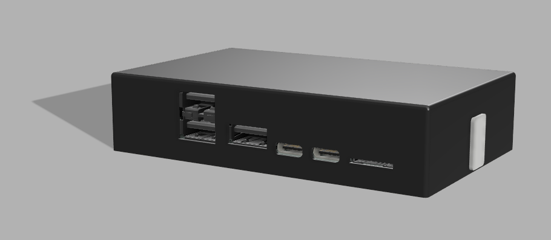
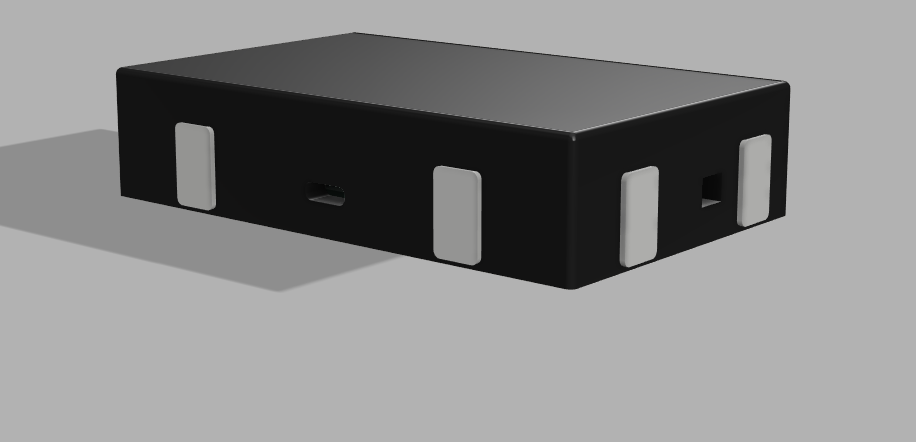
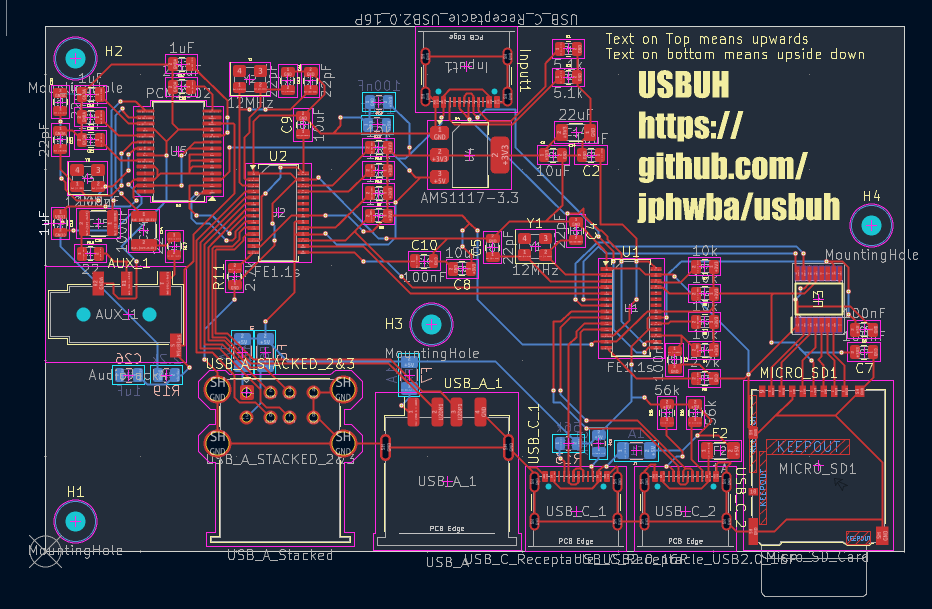
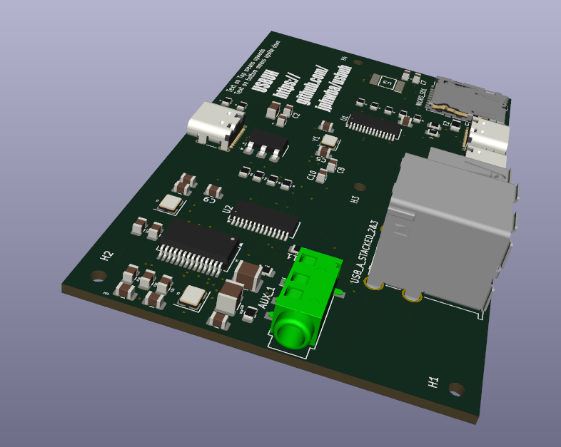
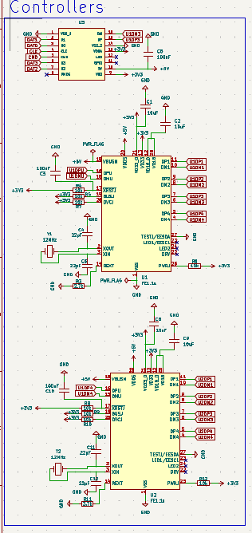
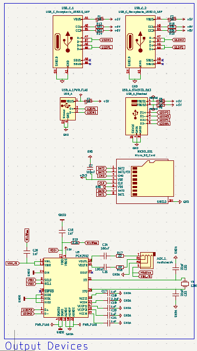
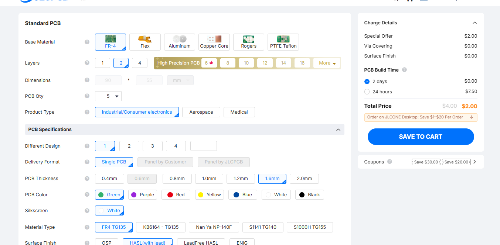

# Usbuh

This is a USB Hub that features USB-C input, an Auxilary Port with Audio in and out, three USB-A 2.0 ports, two USB-C 2.0 ports and a micro SD Card slot. The main USB hub controllers are two FE1.1s's, a GL823K for the micro-sd controller, an AMS1117-3.3 to step down 5v connections into 3v3 and a PCM2902E for the audio controller. I made this because on my desk the area where my PC is requires the top IO to be blocked which had all of these ports and there was no space to run a cable it was a very tight gap so my current solution is running a $5 temu adapter which goes through a USB-C to USB-A adapter ($0.30 from temu) and a USB1.0 extension cable, so my devices do run pretty slow. So I decided to make this. SInce I'm not very experienced with KiCad and with PCB's and everything, I found USB3.0 a bit more complex and I realised that my design was USB2.0 only too far into the project so I just stuck with 2.0. I also decided later in the project that I wanted an aux port since my headset has an audio/mic combo port and my PC only has split and the adapter I used doesn't work. 

## Printing Notice
Please print 5 connector brakets as there is only 1 in the step file.

## Assembly

The USB Hub has a pretty simple assembly requiring only 4 screws. First in the base plate 4 heatset inserts (M2x3.2mm) go into the standoffs. Then the pcb just goes on top and is screwed in. After this, the walls are placed just on top of the base plate and is attatched with connector brackets I made which go along the sides. Then the top plate just props ontop of the walls and then the front cover is attatched by just pressing it into the front of the assembly. 

## Images

### PCB

### PCB Render

### Schematic

### PCB Order

## Bill of Materials: PLEASE NOTE ALL PRICES ARE IN AUSTRALIAN DOLLARS
|Reference                |Qty|Value                      |Footprint                                                            |Datasheet                                                                        |Item Name                                                                                                                       |Qty|Variation                                  |Price (AUD)|Shipping Fee (If Applicable)|Reference                                                                                                                                                                                                                                                                                                                                                                                                                                                                                                                                                                                                                                                                                                                                                                      |
|-------------------------|---|---------------------------|---------------------------------------------------------------------|---------------------------------------------------------------------------------|--------------------------------------------------------------------------------------------------------------------------------|---|-------------------------------------------|-----------|----------------------------|-------------------------------------------------------------------------------------------------------------------------------------------------------------------------------------------------------------------------------------------------------------------------------------------------------------------------------------------------------------------------------------------------------------------------------------------------------------------------------------------------------------------------------------------------------------------------------------------------------------------------------------------------------------------------------------------------------------------------------------------------------------------------------|
|AUX_1                    |1  |AudioJack4                 |Connector_Audio:Jack_3.5mm_PJ320D_Horizontal                         |                                                                                 |10PCS 3.5MM Headphone Jack PJ-320D Audio Jack 4 Pin SMD SMT MP3 Accessories PJ320D                                              |1  |                                           |$1.69      |                            |https://www.aliexpress.com/item/4000661908135.html?spm=a2g0o.productlist.main.1.480eYnEHYnEHCZ&algo_pvid=1d7cbe13-bbd2-4caa-b9eb-c2ccf5896682&algo_exp_id=1d7cbe13-bbd2-4caa-b9eb-c2ccf5896682-0&pdp_ext_f=%7B%22order%22%3A%22282%22%2C%22eval%22%3A%221%22%2C%22fromPage%22%3A%22search%22%7D&pdp_npi=6%40dis%21AUD%211.69%211.42%21%21%211.18%210.99%21%402101d2e717871279418298866e0e15%2110000005519439913%21sea%21AU%210%21ABX%211%210%21n_tag%3A-29910%3Bd%3Aa8aafb62%3Bm03_new_user%3A-29895%3BpisId%3A5000000210966905&curPageLogUid=hUpPbEKPYTWo&utparam-url=scene%3Asearch%7Cquery_from%3A%7Cx_object_id%3A4000661908135%7C_p_origin_prod%3A                                                                                                                        |
|C1,C2,C8,C9,C13          |5  |10uF                       |Capacitor_SMD:C_0805_2012Metric                                      |                                                                                 |20PCS 0805 2012 SMD Capacitor 1UF 2.2UF 4.7UF 10UF 22UF 47UF 100UF 6V3 10V 16V 25V 35V 50V 63V 100V X7R X5R K=�10% M=�20%       |1  |Capacitance: 0805 10UF 10V X7R K           |$1.43      |                            |https://www.aliexpress.com/item/1005007533370902.html?spm=a2g0o.productlist.main.2.1547IBgZIBgZvW&algo_pvid=e9d3b182-8366-4624-99be-2b07136d8850&algo_exp_id=e9d3b182-8366-4624-99be-2b07136d8850-1&pdp_ext_f=%7B%22order%22%3A%22744%22%2C%22eval%22%3A%221%22%2C%22fromPage%22%3A%22search%22%7D&pdp_npi=6%40dis%21AUD%211.55%211.41%21%21%217.28%216.64%21%402101e80b17871284007016579e0d27%2112000041187599516%21sea%21AU%210%21ABX%211%210%21n_tag%3A-29910%3Bd%3Aa8aafb62%3Bm03_new_user%3A-29895%3BpisId%3A5000000215431853&curPageLogUid=Mk3nfcexgL8D&utparam-url=scene%3Asearch%7Cquery_from%3A%7Cx_object_id%3A1005007533370902%7C_p_origin_prod%3A                                                                                                                  |
|C3,C6,C7,C10,C15         |5  |100nF                      |Capacitor_SMD:C_0805_2012Metric                                      |                                                                                 |50PCS 0805 100NF 104K 50V 100V 250V 10% X7R 2012 SMD Chip Multilayer Ceramic Capacitor                                          |1  |(Capacitance: 0805 100NF 104K 50V)         |$1.76      |                            |https://www.aliexpress.com/item/1005007533532838.html?spm=a2g0o.productlist.main.1.864dY1JUY1JU26&algo_pvid=823f64a9-e882-4b37-8e12-8cdb59a4d3ff&algo_exp_id=823f64a9-e882-4b37-8e12-8cdb59a4d3ff-0&pdp_ext_f=%7B%22order%22%3A%22118%22%2C%22eval%22%3A%221%22%2C%22fromPage%22%3A%22search%22%7D&pdp_npi=6%40dis%21AUD%211.76%211.42%21%21%218.28%216.70%21%4021032c8d17871282073026570e0dad%2112000041188037343%21sea%21AU%210%21ABX%211%210%21n_tag%3A-29910%3Bd%3Aa8aafb62%3Bm03_new_user%3A-29895%3BpisId%3A5000000210966905&curPageLogUid=5TJME7p8Dsbw&utparam-url=scene%3Asearch%7Cquery_from%3A%7Cx_object_id%3A1005007533532838%7C_p_origin_prod%3A                                                                                                                  |
|C4,C5,C11,C12,C22,C23    |6  |22pF                       |Capacitor_SMD:C_0805_2012Metric                                      |                                                                                 |100PCS 0805 C0805 20pF 50V 2012 Capacitor 1PF-47UF ( 10PF 22PF 47PF 100PF 1NF 2.2NF 10NF 100NF 1UF 2.2UF 4.7UF 10UF 22UF )      |1  |(Capacitance: 22PF)                        |$2.15      |                            |https://www.aliexpress.com/item/1106549969.html?spm=a2g0o.productlist.main.1.6fdc5a0u5a0uOb&algo_pvid=db95abb8-0ab2-444d-a9d9-9a6451e7800c&algo_exp_id=db95abb8-0ab2-444d-a9d9-9a6451e7800c-0&pdp_ext_f=%7B%22order%22%3A%22157%22%2C%22eval%22%3A%221%22%2C%22fromPage%22%3A%22search%22%7D&pdp_npi=6%40dis%21AUD%211.41%211.41%21%21%210.98%210.98%21%402101d2e717871286391835327e0dd3%2112000057585931086%21sea%21AU%210%21ABX%211%210%21n_tag%3A-29910%3Bd%3Aa8aafb62%3Bm03_new_user%3A-29895&curPageLogUid=ZnC05rkv977i&utparam-url=scene%3Asearch%7Cquery_from%3A%7Cx_object_id%3A1106549969%7C_p_origin_prod%3A                                                                                                                                                         |
|C14                      |1  |22uF                       |Capacitor_SMD:C_1206_3216Metric                                      |                                                                                 |20PCS 0805 2012 SMD Capacitor 1UF 2.2UF 4.7UF 10UF 22UF 47UF 100UF 6V3 10V 16V 25V 35V 50V 63V 100V X7R X5R K=�10% M=�20%       |1  |(Capacitance: 0805 22UF 10V X7R K)         |$1.50      |                            |https://www.aliexpress.com/item/1005007533370902.html?spm=a2g0o.productlist.main.2.1547IBgZIBgZvW&algo_pvid=e9d3b182-8366-4624-99be-2b07136d8850&algo_exp_id=e9d3b182-8366-4624-99be-2b07136d8850-1&pdp_ext_f=%7B%22order%22%3A%22744%22%2C%22eval%22%3A%221%22%2C%22fromPage%22%3A%22search%22%7D&pdp_npi=6%40dis%21AUD%211.55%211.41%21%21%217.28%216.64%21%402101e80b17871284007016579e0d27%2112000041187599516%21sea%21AU%210%21ABX%211%210%21n_tag%3A-29910%3Bd%3Aa8aafb62%3Bm03_new_user%3A-29895%3BpisId%3A5000000215431853&curPageLogUid=Mk3nfcexgL8D&utparam-url=scene%3Asearch%7Cquery_from%3A%7Cx_object_id%3A1005007533370902%7C_p_origin_prod%3A                                                                                                                  |
|C16,C17,C19,C20,C21,C26  |6  |1uF                        |Capacitor_SMD:C_0805_2012Metric                                      |                                                                                 |100PCS 0805 C0805 20pF 50V 2012 Capacitor 1PF-47UF ( 10PF 22PF 47PF 100PF 1NF 2.2NF 10NF 100NF 1UF 2.2UF 4.7UF 10UF 22UF )      |1  |(Capacitance: 1UF)                         |$2.15      |                            |https://www.aliexpress.com/item/1106549969.html?spm=a2g0o.productlist.main.1.6fdc5a0u5a0uOb&algo_pvid=db95abb8-0ab2-444d-a9d9-9a6451e7800c&algo_exp_id=db95abb8-0ab2-444d-a9d9-9a6451e7800c-0&pdp_ext_f=%7B%22order%22%3A%22157%22%2C%22eval%22%3A%221%22%2C%22fromPage%22%3A%22search%22%7D&pdp_npi=6%40dis%21AUD%211.41%211.41%21%21%210.98%210.98%21%402101d2e717871286391835327e0dd3%2112000057585931086%21sea%21AU%210%21ABX%211%210%21n_tag%3A-29910%3Bd%3Aa8aafb62%3Bm03_new_user%3A-29895&curPageLogUid=ZnC05rkv977i&utparam-url=scene%3Asearch%7Cquery_from%3A%7Cx_object_id%3A1106549969%7C_p_origin_prod%3A                                                                                                                                                         |
|C18                      |1  |2.2uF                      |Capacitor_SMD:C_0805_2012Metric                                      |                                                                                 |100PCS 0805 C0805 20pF 50V 2012 Capacitor 1PF-47UF ( 10PF 22PF 47PF 100PF 1NF 2.2NF 10NF 100NF 1UF 2.2UF 4.7UF 10UF 22UF )      |1  |(Capacitance: 2.2UF)                       |$2.15      |                            |https://www.aliexpress.com/item/1106549969.html?spm=a2g0o.productlist.main.1.6fdc5a0u5a0uOb&algo_pvid=db95abb8-0ab2-444d-a9d9-9a6451e7800c&algo_exp_id=db95abb8-0ab2-444d-a9d9-9a6451e7800c-0&pdp_ext_f=%7B%22order%22%3A%22157%22%2C%22eval%22%3A%221%22%2C%22fromPage%22%3A%22search%22%7D&pdp_npi=6%40dis%21AUD%211.41%211.41%21%21%210.98%210.98%21%402101d2e717871286391835327e0dd3%2112000057585931086%21sea%21AU%210%21ABX%211%210%21n_tag%3A-29910%3Bd%3Aa8aafb62%3Bm03_new_user%3A-29895&curPageLogUid=ZnC05rkv977i&utparam-url=scene%3Asearch%7Cquery_from%3A%7Cx_object_id%3A1106549969%7C_p_origin_prod%3A                                                                                                                                                         |
|C24,C25                  |2  |100uF                      |Capacitor_SMD:C_1210_3225Metric                                      |                                                                                 |20PCS 0805 SMD Capacitor 1UF 2.2UF 4.7UF 10UF 22UF 47UF 100UF 6V3 10V 16V 25V 35V 50V 63V 100V X7R X5R K=�10% M=�20%            |1  |Resistance:�0805 100UF 10V X5R M           |$13.29     |                            |https://www.aliexpress.com/item/1005006815492689.html?spm=a2g0o.productlist.main.2.33c8Vz0NVz0NGy&algo_pvid=6a07cffa-76c0-45da-abe8-3d6f93a84eff&algo_exp_id=6a07cffa-76c0-45da-abe8-3d6f93a84eff-1&pdp_ext_f=%7B%22order%22%3A%22193%22%2C%22eval%22%3A%221%22%2C%22fromPage%22%3A%22search%22%7D&pdp_npi=6%40dis%21AUD%214.49%214.49%21%21%2121.12%2121.12%21%402103128817871318814017192e1028%2112000038394958489%21sea%21AU%210%21ABX%211%210%21n_tag%3A-29910%3Bd%3Aa8aafb62%3Bm03_new_user%3A-29895&curPageLogUid=5ZHOhuEXpiOp&utparam-url=scene%3Asearch%7Cquery_from%3A%7Cx_object_id%3A1005006815492689%7C_p_origin_prod%3A                                                                                                                                           |
|F1,F2,F5,F6,F7           |5  |1A                         |Fuse:Fuse_1206_3216Metric                                            |                                                                                 |3216 1206 0.05A 0.1A 0.12A 0.16A 0.2A 0.25A 0.5A 0.75A 1.1A 2A SMD Resettable Fuse PPTC PolySwitch Self-Recovery Fuse           |1  |(AMP: 1A, Size: 1206, Temperature: 20 Pcs) |$3.38      |                            |https://www.aliexpress.com/item/1005004273302126.html?spm=a2g0o.productlist.main.8.783cL8qUL8qUoq&aem_p4p_detail=202608190140085979759014290040002905721&algo_pvid=c80d8eca-9437-45f4-b12f-dc8b7876a61d&algo_exp_id=c80d8eca-9437-45f4-b12f-dc8b7876a61d-7&pdp_ext_f=%7B%22order%22%3A%22330%22%2C%22eval%22%3A%221%22%2C%22fromPage%22%3A%22search%22%7D&pdp_npi=6%40dis%21AUD%213.35%211.92%21%21%2115.74%219.02%21%402103292b17871288085661379e0d24%2112000028591117824%21sea%21AU%210%21ABX%211%210%21n_tag%3A-29910%3Bd%3Aa8aafb62%3Bm03_new_user%3A-29895%3BpisId%3A5000000211078594&curPageLogUid=3kfdORI0Allh&utparam-url=scene%3Asearch%7Cquery_from%3A%7Cx_object_id%3A1005004273302126%7C_p_origin_prod%3A&search_p4p_id=202608190140085979759014290040002905721_2  |
|Input1,USB_C_1,USB_C_2   |3  |USB_C_Receptacle_USB2.0_16P|Connector_USB:USB_C_Receptacle_GCT_USB4105-xx-A_16P_TopMnt_Horizontal|https://www.usb.org/sites/default/files/documents/usb_type-c.zip                 |10-100Pcs USB4105-GF-A 16Pin Type-C Female Socket SMT Top Mount PCB Receptacle USB2.0 16P Right Angle SMD Connector Replacement |1  |(Color: 10pcs)                             |$4.89      |                            |https://www.aliexpress.com/item/1005012606240318.html?spm=a2g0o.productlist.main.1.3988Rk48Rk48rj&algo_pvid=a48576c6-6391-4b0b-ba1d-1bc5c47abf6c&algo_exp_id=a48576c6-6391-4b0b-ba1d-1bc5c47abf6c-0&pdp_ext_f=%7B%22order%22%3A%22-1%22%2C%22eval%22%3A%221%22%2C%22fromPage%22%3A%22search%22%7D&pdp_npi=6%40dis%21AUD%214.89%214.89%21%21%213.41%213.41%21%402101ca8b17871289589715928e0fc0%2112000058803029532%21sea%21AU%210%21ABX%211%210%21n_tag%3A-29910%3Bd%3Aa8aafb62%3Bm03_new_user%3A-29895&curPageLogUid=6wQ0KNcgeL4R&utparam-url=scene%3Asearch%7Cquery_from%3A%7Cx_object_id%3A1005012606240318%7C_p_origin_prod%3A                                                                                                                                              |
|MICRO_SD1                |1  |Micro_SD_Card              |Connector_Card:microSD_HC_Hirose_DM3AT-SF-PEJM5                      |https://www.we-online.com/components/products/datasheet/693072010801.pdf         |100% brand new original connector DM3AT-SF-PEJM5 micro SD memory card slot TF card slot 10P                                     |1  |(Model Number: 1pcs)                       |$0.77      |$9.48                       |https://www.aliexpress.com/item/1005009087733553.html?spm=a2g0o.productlist.main.15.751dDbhjDbhjlK&algo_pvid=f6680530-a06a-4709-bbb3-131b95bec2e5&algo_exp_id=f6680530-a06a-4709-bbb3-131b95bec2e5-14&pdp_ext_f=%7B%22order%22%3A%221%22%2C%22eval%22%3A%221%22%2C%22fromPage%22%3A%22search%22%7D&pdp_npi=6%40dis%21AUD%217.23%217.23%21%21%2133.99%2133.99%21%40210328c017871290378153527e0cf1%2112000047863287922%21sea%21AU%210%21ABX%211%210%21n_tag%3A-29910%3Bd%3Aa8aafb62%3Bm03_new_user%3A-29895&curPageLogUid=MgBSLzHxUQIx&utparam-url=scene%3Asearch%7Cquery_from%3A%7Cx_object_id%3A1005009087733553%7C_p_origin_prod%3A                                                                                                                                           |
|R1,R2                    |2  |5.1k                       |Resistor_SMD:R_0805_2012Metric                                       |                                                                                 |100PCS 0805 5% 0R-10M 1R 2.2R 10R 22R 47R 100R 560R 1K2 6.8K 10K 12K 20K 47K 100K 510K 910K 1M 4.7M 9.1M 1/8W                   |1  |(Resistance: 5.1k)                         |$0.55      |$2.85                       |https://www.aliexpress.com/item/1005004542018347.html?spm=a2g0o.productlist.main.3.80a53lEQ3lEQWy&algo_pvid=b3b168c2-a43c-439a-905d-d717cd2ab66c&algo_exp_id=b3b168c2-a43c-439a-905d-d717cd2ab66c-18&pdp_ext_f=%7B%22order%22%3A%221185%22%2C%22eval%22%3A%221%22%2C%22fromPage%22%3A%22search%22%7D&pdp_npi=6%40dis%21AUD%210.55%210.49%21%21%212.58%212.32%21%402101c28d17871291807744745e0ecc%2112000029542986608%21sea%21AU%210%21ABX%211%210%21n_tag%3A-29910%3Bd%3Aa8aafb62%3Bm03_new_user%3A-29895&curPageLogUid=qrX8XUrJFErs&utparam-url=scene%3Asearch%7Cquery_from%3A%7Cx_object_id%3A1005004542018347%7C_p_origin_prod%3A                                                                                                                                           |
|R3,R11                   |2  |2.7k                       |Resistor_SMD:R_0805_2012Metric                                       |                                                                                 |100PCS 0805 5% 0R-10M 1R 2.2R 10R 22R 47R 100R 560R 1K2 6.8K 10K 12K 20K 47K 100K 510K 910K 1M 4.7M 9.1M 1/8W                   |1  |(Resistance: 2.7k)                         |$0.55      |$2.85                       |https://www.aliexpress.com/item/1005004542018347.html?spm=a2g0o.productlist.main.3.80a53lEQ3lEQWy&algo_pvid=b3b168c2-a43c-439a-905d-d717cd2ab66c&algo_exp_id=b3b168c2-a43c-439a-905d-d717cd2ab66c-18&pdp_ext_f=%7B%22order%22%3A%221185%22%2C%22eval%22%3A%221%22%2C%22fromPage%22%3A%22search%22%7D&pdp_npi=6%40dis%21AUD%210.55%210.49%21%21%212.58%212.32%21%402101c28d17871291807744745e0ecc%2112000029542986608%21sea%21AU%210%21ABX%211%210%21n_tag%3A-29910%3Bd%3Aa8aafb62%3Bm03_new_user%3A-29895&curPageLogUid=qrX8XUrJFErs&utparam-url=scene%3Asearch%7Cquery_from%3A%7Cx_object_id%3A1005004542018347%7C_p_origin_prod%3A                                                                                                                                           |
|R4,R5,R6,R7,R8,R9,R10,R12|8  |10k                        |Resistor_SMD:R_0805_2012Metric                                       |                                                                                 |100PCS 0805 5% 0R-10M 1R 2.2R 10R 22R 47R 100R 560R 1K2 6.8K 10K 12K 20K 47K 100K 510K 910K 1M 4.7M 9.1M 1/8W                   |1  |(Resistance: 10k)                          |$0.55      |$2.85                       |https://www.aliexpress.com/item/1005004542018347.html?spm=a2g0o.productlist.main.3.80a53lEQ3lEQWy&algo_pvid=b3b168c2-a43c-439a-905d-d717cd2ab66c&algo_exp_id=b3b168c2-a43c-439a-905d-d717cd2ab66c-18&pdp_ext_f=%7B%22order%22%3A%221185%22%2C%22eval%22%3A%221%22%2C%22fromPage%22%3A%22search%22%7D&pdp_npi=6%40dis%21AUD%210.55%210.49%21%21%212.58%212.32%21%402101c28d17871291807744745e0ecc%2112000029542986608%21sea%21AU%210%21ABX%211%210%21n_tag%3A-29910%3Bd%3Aa8aafb62%3Bm03_new_user%3A-29895&curPageLogUid=qrX8XUrJFErs&utparam-url=scene%3Asearch%7Cquery_from%3A%7Cx_object_id%3A1005004542018347%7C_p_origin_prod%3A                                                                                                                                           |
|R13,R14,R15,R16          |4  |56k                        |Resistor_SMD:R_0805_2012Metric                                       |                                                                                 |100PCS 0805 5% 0R-10M 1R 2.2R 10R 22R 47R 100R 560R 1K2 6.8K 10K 12K 20K 47K 100K 510K 910K 1M 4.7M 9.1M 1/8W                   |1  |(Resistance: 56k)                          |$0.55      |$2.85                       |https://www.aliexpress.com/item/1005004542018347.html?spm=a2g0o.productlist.main.3.80a53lEQ3lEQWy&algo_pvid=b3b168c2-a43c-439a-905d-d717cd2ab66c&algo_exp_id=b3b168c2-a43c-439a-905d-d717cd2ab66c-18&pdp_ext_f=%7B%22order%22%3A%221185%22%2C%22eval%22%3A%221%22%2C%22fromPage%22%3A%22search%22%7D&pdp_npi=6%40dis%21AUD%210.55%210.49%21%21%212.58%212.32%21%402101c28d17871291807744745e0ecc%2112000029542986608%21sea%21AU%210%21ABX%211%210%21n_tag%3A-29910%3Bd%3Aa8aafb62%3Bm03_new_user%3A-29895&curPageLogUid=qrX8XUrJFErs&utparam-url=scene%3Asearch%7Cquery_from%3A%7Cx_object_id%3A1005004542018347%7C_p_origin_prod%3A                                                                                                                                           |
|R17,R18                  |2  |22                         |Resistor_SMD:R_0805_2012Metric                                       |                                                                                 |100PCS 0805 5% 0R-10M 1R 2.2R 10R 22R 47R 100R 560R 1K2 6.8K 10K 12K 20K 47K 100K 510K 910K 1M 4.7M 9.1M 1/8W                   |1  |(Resistance: 22R)                          |$0.55      |$2.85                       |https://www.aliexpress.com/item/1005004542018347.html?spm=a2g0o.productlist.main.3.80a53lEQ3lEQWy&algo_pvid=b3b168c2-a43c-439a-905d-d717cd2ab66c&algo_exp_id=b3b168c2-a43c-439a-905d-d717cd2ab66c-18&pdp_ext_f=%7B%22order%22%3A%221185%22%2C%22eval%22%3A%221%22%2C%22fromPage%22%3A%22search%22%7D&pdp_npi=6%40dis%21AUD%210.55%210.49%21%21%212.58%212.32%21%402101c28d17871291807744745e0ecc%2112000029542986608%21sea%21AU%210%21ABX%211%210%21n_tag%3A-29910%3Bd%3Aa8aafb62%3Bm03_new_user%3A-29895&curPageLogUid=qrX8XUrJFErs&utparam-url=scene%3Asearch%7Cquery_from%3A%7Cx_object_id%3A1005004542018347%7C_p_origin_prod%3A                                                                                                                                           |
|R19                      |1  |2.2k                       |Resistor_SMD:R_0805_2012Metric                                       |                                                                                 |100PCS 0805 5% 0R-10M 1R 2.2R 10R 22R 47R 100R 560R 1K2 6.8K 10K 12K 20K 47K 100K 510K 910K 1M 4.7M 9.1M 1/8W                   |1  |(Resistance: 2.2k)                         |$0.55      |$2.85                       |https://www.aliexpress.com/item/1005004542018347.html?spm=a2g0o.productlist.main.3.80a53lEQ3lEQWy&algo_pvid=b3b168c2-a43c-439a-905d-d717cd2ab66c&algo_exp_id=b3b168c2-a43c-439a-905d-d717cd2ab66c-18&pdp_ext_f=%7B%22order%22%3A%221185%22%2C%22eval%22%3A%221%22%2C%22fromPage%22%3A%22search%22%7D&pdp_npi=6%40dis%21AUD%210.55%210.49%21%21%212.58%212.32%21%402101c28d17871291807744745e0ecc%2112000029542986608%21sea%21AU%210%21ABX%211%210%21n_tag%3A-29910%3Bd%3Aa8aafb62%3Bm03_new_user%3A-29895&curPageLogUid=qrX8XUrJFErs&utparam-url=scene%3Asearch%7Cquery_from%3A%7Cx_object_id%3A1005004542018347%7C_p_origin_prod%3A                                                                                                                                           |
|U1,U2                    |2  |FE1.1s                     |Package_SO:SSOP-28_3.9x9.9mm_P0.635mm                                |https://cdn-shop.adafruit.com/product-files/2991/FE1.1s+Data+Sheet+(Rev.+1.0).pdf|10Pcs 100% New original USB chip FE1.1s USB2.0 HUB shunt SSOP-28 IC Chip in stock                                               |1  |                                           |$5.39      |                            |https://www.aliexpress.com/item/1005004507102883.html?spm=a2g0o.productlist.main.4.2671884cXHyQZL&aem_p4p_detail=20260819015052984397358888940000028817&algo_pvid=9fde53a9-891d-4212-bc47-c522009a8cec&algo_exp_id=9fde53a9-891d-4212-bc47-c522009a8cec-3&pdp_ext_f=%7B%22order%22%3A%22254%22%2C%22eval%22%3A%221%22%2C%22fromPage%22%3A%22search%22%7D&pdp_npi=6%40dis%21AUD%215.39%215.39%21%21%213.76%213.76%21%40210311c217871294519725001e0f54%2112000029405472957%21sea%21AU%210%21ABX%211%210%21n_tag%3A-29910%3Bd%3Aa8aafb62%3Bm03_new_user%3A-29895&curPageLogUid=LPqb8guIAZUH&utparam-url=scene%3Asearch%7Cquery_from%3A%7Cx_object_id%3A1005004507102883%7C_p_origin_prod%3A&search_p4p_id=20260819015052984397358888940000028817_1                                |
|U3                       |1  |GL823K                     |GL823K:SOP64P600X175-16N                                             |                                                                                 |5PCS MAX5456EEE MAX5456 MAX3221CDBR MA3221C MA3221 ZXCD1000EQ16TA ZXCD1000 GL823K GL823 FT230XS FT230 SSOP-16                   |1  |(Color: GL823K)                            |$7.79      |$5.15                       |https://www.aliexpress.com/item/1005012942277018.html?spm=a2g0o.productlist.main.5.2ea27fcbb2Qbq3&algo_pvid=e146ea63-e196-47f9-aeff-362bb74432f0&algo_exp_id=e146ea63-e196-47f9-aeff-362bb74432f0-34&pdp_ext_f=%7B%22order%22%3A%22-1%22%2C%22eval%22%3A%221%22%2C%22fromPage%22%3A%22search%22%7D&pdp_npi=6%40dis%21AUD%217.79%217.79%21%21%215.43%215.43%21%402101de2517871295047478004e0d63%2112000059826681312%21sea%21AU%210%21ABX%211%210%21n_tag%3A-29910%3Bd%3Aa8aafb62%3Bm03_new_user%3A-29895&curPageLogUid=eN5GpfKu2HhC&utparam-url=scene%3Asearch%7Cquery_from%3A%7Cx_object_id%3A1005012942277018%7C_p_origin_prod%3A                                                                                                                                             |
|U4                       |1  |AMS1117-3.3                |Package_TO_SOT_SMD:SOT-223-3_TabPin2                                 |http://www.advanced-monolithic.com/pdf/ds1117.pdf                                |50PCS AMS1117 3V3 AMS1117-3.3 SOT223 Voltage Rugulator                                                                          |1  |Color:�AMS1117-3.3(50PCS)                  |$7.88      |                            |https://www.aliexpress.com/item/1005007416774959.html?spm=a2g0o.productlist.main.3.1c2d3f4b1EIIjt&algo_pvid=03494082-8f65-4d87-9c67-fdfe50357e45&algo_exp_id=03494082-8f65-4d87-9c67-fdfe50357e45-2&pdp_ext_f=%7B%22order%22%3A%2223%22%2C%22eval%22%3A%221%22%2C%22fromPage%22%3A%22search%22%7D&pdp_npi=6%40dis%21AUD%217.88%211.42%21%21%2137.05%216.69%21%402101de2517871295686261363e0d63%2112000040664805895%21sea%21AU%210%21ABX%211%210%21n_tag%3A-29910%3Bd%3Aa8aafb62%3Bm03_new_user%3A-29895%3BpisId%3A5000000210966905&curPageLogUid=1it723zTaJ45&utparam-url=scene%3Asearch%7Cquery_from%3A%7Cx_object_id%3A1005007416774959%7C_p_origin_prod%3A                                                                                                                  |
|U5                       |1  |PCM2902                    |Package_SO:SSOP-28_5.3x10.2mm_P0.65mm                                |http://www.ti.com/lit/ds/symlink/pcm2902c.pdf                                    |100%New Original PCM2902E PCM2902 SSOP-28 In Stock                                                                              |1  |(Color: 2PCS)                              |$3.24      |                            |https://www.aliexpress.com/item/1005005459552093.html?spm=a2g0o.productlist.main.2.29cf7b60Ps13Mw&algo_pvid=6da090d6-f139-4355-b311-8f439d26c516&algo_exp_id=6da090d6-f139-4355-b311-8f439d26c516-1&pdp_ext_f=%7B%22order%22%3A%2224%22%2C%22eval%22%3A%221%22%2C%22fromPage%22%3A%22search%22%7D&pdp_npi=6%40dis%21AUD%213.24%213.24%21%21%212.27%212.27%21%402101c4ea17872023725686875e0ee2%2112000038497694300%21sea%21AU%210%21ABX%211%210%21n_tag%3A-29910%3Bd%3Aa8aafb62%3Bm03_new_user%3A-29895&curPageLogUid=BnoCQy2PhTV1&utparam-url=scene%3Asearch%7Cquery_from%3A%7Cx_object_id%3A1005005459552093%7C_p_origin_prod%3A                                                                                                                                              |
|Y1,Y2,Y3                 |3  |12MHz                      |Crystal:Crystal_SMD_3225-4Pin_3.2x2.5mm                              |                                                                                 |10PCS SMD 3225 SMD passive quartz crystal oscillator 8Mhz 10Mhz 12Mhz 16Mhz 20Mhz 24Mhz 26Mhz 30Mhz 32Mhz 40Mhz 48Mhz 8.000Mhz  |1  |(Color: 12Mhz)                             |$2.81      |$2.93                       |https://www.aliexpress.com/item/1005004389041900.html?spm=a2g0o.productlist.main.1.3939gbOzgbOzTf&algo_pvid=cde5d7b1-ce4d-483e-afb0-0da2121b7b46&algo_exp_id=cde5d7b1-ce4d-483e-afb0-0da2121b7b46-0&pdp_ext_f=%7B%22order%22%3A%22234%22%2C%22eval%22%3A%221%22%2C%22fromPage%22%3A%22search%22%7D&pdp_npi=6%40dis%21AUD%212.80%211.42%21%21%211.95%210.99%21%402103128817871298979451901e0f41%2112000029007012954%21sea%21AU%210%21ABX%211%210%21n_tag%3A-29910%3Bd%3Aa8aafb62%3Bm03_new_user%3A-29895%3BpisId%3A5000000211078594&curPageLogUid=VFE1twjKUv2f&utparam-url=scene%3Asearch%7Cquery_from%3A%7Cx_object_id%3A1005004389041900%7C_p_origin_prod%3A                                                                                                                  |
|Heatset Inserts          |4  |M2x3.2mm                   |                                                                     |                                                                                 |10/15/20/40/50/100pcs M1 M1.2 M1.4 M2 M2.5 M3 M4 M5 M6 M8 Thread Knurled Brass Heat Insert Nut Copper Embedment Embed Parts Nuts|1  |Size:�M2x3.2mm (50pcs), Color: Length 3.5mm|$3.37      |$2.14                       |https://www.aliexpress.com/item/1005007424930348.html?spm=a2g0o.productlist.main.1.5556Fhf8Fhf87L&algo_pvid=2ee8972e-2e0c-42ee-8637-2715276b8897&algo_exp_id=2ee8972e-2e0c-42ee-8637-2715276b8897-0&pdp_ext_f=%7B%22order%22%3A%224424%22%2C%22eval%22%3A%221%22%2C%22fromPage%22%3A%22search%22%7D&pdp_npi=6%40dis%21AUD%212.43%211.46%21%21%2111.44%216.86%21%402101d2e717871304528175378e0d4f%2112000040708235172%21sea%21AU%210%21ABX%211%210%21n_tag%3A-29910%3Bd%3Aa8aafb62%3Bm03_new_user%3A-29895&curPageLogUid=3m3ye9669a0d&utparam-url=scene%3Asearch%7Cquery_from%3A%7Cx_object_id%3A1005007424930348%7C_p_origin_prod%3A                                                                                                                                           |
|Screws                   |4  |M2x5mm                     |                                                                     |                                                                                 |50/100/200pcs M1 M1.2 M1.4 M1.6 M2 M2.5 M3 M4 Cross Recessed Phillips Flat Countersunk Head Screw Bolt GB819 Black Carbon Steel |1  |Length:�100pcs M2x5mm                      |$3.91      |                            |https://www.aliexpress.com/item/1005006995421098.html?spm=a2g0o.productlist.main.9.6b7a38decxTAYV&algo_pvid=a973f749-4591-4e0e-a093-ea8c23d4c880&algo_exp_id=a973f749-4591-4e0e-a093-ea8c23d4c880-8&pdp_ext_f=%7B%22order%22%3A%2222617%22%2C%22eval%22%3A%221%22%2C%22orig_sl_item_id%22%3A%221005006995421098%22%2C%22orig_item_id%22%3A%221005006674812661%22%2C%22fromPage%22%3A%22search%22%7D&pdp_npi=6%40dis%21AUD%214.51%211.42%21%21%2121.22%216.68%21%40210328df17871305228055295e0e44%2112000038985462865%21sea%21AU%210%21ABX%211%210%21n_tag%3A-29910%3Bd%3Aa8aafb62%3Bm03_new_user%3A-29895%3BpisId%3A5000000210976560&curPageLogUid=ppDyABv8GrOk&utparam-url=scene%3Asearch%7Cquery_from%3A%7Cx_object_id%3A1005006995421098%7C_p_origin_prod%3A1005006674812661|
|PCB                      |1  |90x55                      |                                                                     |                                                                                 |JLPCB                                                                                                                           |   |                                           |$23.00     |                            |                                                                                                                                                                                                                                                                                                                                                                                                                                                                                                                                                                                                                                                                                                                                                                               |
|Printing Legion          |1  |                           |                                                                     |                                                                                 |                                                                                                                                |   |                                           |$14.00     |                            |                                                                                                                                                                                                                                                                                                                                                                                                                                                                                                                                                                                                                                                                                                                                                                               |
|USB_A_1                  |1  |USB_A                      |Connector_USB:USB_A_Receptacle_GCT_USB1046                           |                                                                                 |                                                                                                                                |   |                                           |           |                            |                                                                                                                                                                                                                                                                                                                                                                                                                                                                                                                                                                                                                                                                                                                                                                               |
|USB_A_STACKED_2&3        |1  |USB_A_Stacked              |Connector_USB:USB_A_Wuerth_61400826021_Horizontal_Stacked            |                                                                                 |                                                                                                                                |   |                                           |           |                            |                                                                                                                                                                                                                                                                                                                                                                                                                                                                                                                                                                                                                                                                                                                                                                               |
|                         |   |                           |Total Price:                                                         |                                                                                 |                                                                                                                                |   |                                           |$127.65    |                            |                                                                                                                                                                                                                                                                                                                                                                                                                                                                                                                                                                                                                                                                                                                                                                               |
